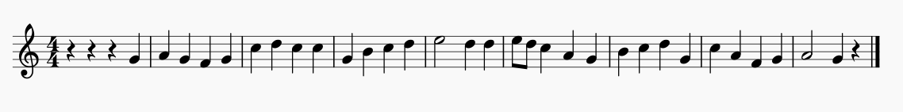
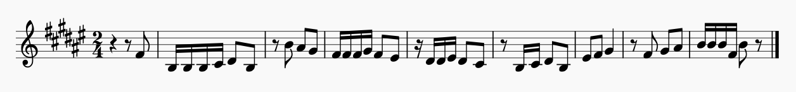
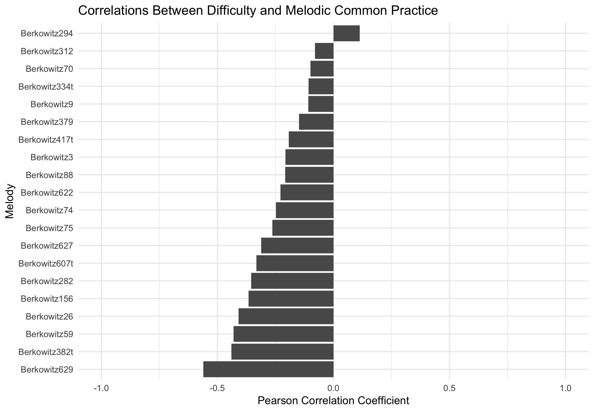

# Computation Chapter

## Rationale

Music theorists use their experience and intuitions to build appropriate curricula for their aural skills pedagogy.
Teaching aural skills typically starts with providing students with simpler exercises, often employing a limited number of notes and rhythms, and then slowly progressing to more difficult repertoire. 
This progression from simpler to more difficult exercises is evident in aural skills text books.
Of the major aural skills textbooks such as the @ottmanMusicSightSinging2014, @berkowitzNewApproachSight2011, @karpinskiManualEarTraining2007, and @clelandDevelopingMusicianshipAural2010, each is structured in a way that musical material presented earlier in the book is more manageable than that nearer the end.
In fact, this is true of almost any étude book: open to a random page in a book of musical studies and the difficulty of the study will likely scale accordingly to its relative position in the textbook.
But it is not a melody's position in a textbook that makes it difficult to perform: this difficulty comes from the structural elements from the music itself.

Intuitively, music theorists have a general understanding of what makes a melody difficult to dictate.
Factors that might contribute to this complexity could range from the number of notes in the melody, to the intricacies of the rhythms involved, to the scale from which the melody derives, or even more intuitively understood factors such as how tonal the melody sounds.
Although given all these factors, there is no definitive combination of features that perfectly predicts the degree to which pedagogues will agree how complex a melody is.
In many ways, questions of melodic complexity are very much like questions of melodic similarity: it depends on both who is asking the question and for what reasons [@cambouropoulosHowSimilarSimilar2009].

Looking at the melodies presented in Figures X and Y, most aural skills pedagogues will be able to successfully intuit which melody is more complex, and presumably, more difficulty to dictate.

* FIGURE 1 -- Melody with 8 Bars, functional accidentals (V/V, V/IV)

* FIGURE 2 -- Same sets of notes rearranged 

While I reserve an extended discussion of what features might characterize why one melody is more difficult to dictate than the other  for this chapter, I assume that these melodies differ in their ability to be dictated in some fundamental way when performed in a similar fashion.
Additionally, many readers of this dissertation can draw from anecdotal evidence of their own as to how students at various stages of their aural training might fair when asked to dictate both melodies.
For some, melody Y might be overwhelmingly difficult.

In fact, melody Y might be overwhelmingly difficult for the vast majority of musicians to dictate.
From a pedagogical standpoint, educators need to be able to know how difficult melodies are to dictate in order to ensure a degree of fairness when assessing a student's performance.
While of course with each student there are inevitably many variables at play in aural skills instruction ranging from personal abilities, to the goals of the instructor in the scope of their course, I find it fair to claim that pedagogues assume that students will be expected to pass pre-established benchmarks throughout their aural skills education.
As students progress they are expected to be able to dictate more difficult melodies, yet exactly what makes a melody complex and thus difficult to dictate is often left to the expertise and intuition of a pedagogue.
Intuition is an important skill for teachers to cultivate, but when it comes to determining objective measures of judgment, reserach from decison making science tends to suggest that no matter the expertiese, collective and objective knowledge tends to outperform a single person's judgment (KAHHMEAN AND TVERSKY, HEART ATTACK PAPER, LOGISITC REGRESSION THING). 

In this chapter I examine how tools from computational musicology can be used to help model an aural skills pedagogue's notion of complexity in melodies.
First, I establish that theorists agree on the differences in melodic complexity using results from a survey of 40 aural skills pedagogues.
Second, I explore how both static and dynamic computationally derived abstracted features of melodies can and cannot be used to approximate an aural skills pedagogue's intuition. 
Third and finally, I use evidence afforded by research in computational musicology to posit that the distributional patterns in a corpus of music can be strategically employed to create a more linear path to success among students of aural skills.
I demonstrate how combining evidence from the statistical learning hypothesis, the probabilistic prediction hypothesis, and a newly posited distributional frequency hypothesis, it is possible to explain why some musical sequences in a melody are easier to dictate than others.
Using this logic, I then create a new compendium of melodic incipits, sorted by their perceptual complexity, that can be used for teaching applications.

## Agreeing on Complexity

Returning to melodies X and Y from above, an aural skills pedagogue most likely has an intuition to which of the two melodies X or Y would be easier to dictate.
Melody X exhibits a predictable melodic syntax and phrase structure, the chromatic notes resolve within the conventions of the Common Practice period, and many of the melodic motives outline and imply a harmony based on tertian harmony.
On the other hand, Melody Y's syntax does not conform to the conventions of the Common Practice period and does not imply any sort of underlying harmony.
The duration of the rhythms appear irregular and the melody implies an uneven phrase structure.
Yet both melodies X and Y have the exact same set of notes and rhythms.
Though despite these content similarities, it would be safe to assume that melody X is probably much easier to dictate than melody Y assuming both were to be played in a similar fashion. 

In fact, aural skills pedagogues tend to agree for the most part on questions of difficulty of dictation.
To demonstrate this, I surveyed 40 aural skills pedagogues who all have taught aural skills at the post-secondary  level.
In this survey, participants were asked the questions presented in TABLE X and TABLE Y using a sample of 20 melodies found in the a commonly used sight-singing text book [@berkowitzNewApproachSight2011].
I present the details of the survey below.

### Methods

To select the melodies used in this survey, I randomly sampled 30 melodies from a corpus of melodies (N = 481) from the Fifth Edition of the Berkowitz "A New Approach to Sight Singing" [@berkowitzNewApproachSight2011] in order to ensure a representative sampling of melodies that might be used in a pedagogical setting.
After piloting the randomly sampled melodies on a colleague, I again randomly sampled half of this sub-set and then added in five more melodies that were not in the new set from earlier sections of the book in order to be more representative of materials students might find in the first two semesters of their aural skills pedagogy. 
I ran the survey from January 31st of 2019 until March 7th, 2019.
The survey comprised of two sets of questions.

Six questions asked about the teaching background of respondents and can be found in TABLE 1.
These questions were followed by asking participants to make five ratings over the 20 different melodies.
The five questions can be found in TABLE 2. 
To encourage participation, two $30 cash prize was offered to two participants. 
The survey had questions that specifically were designed to gauge their appropriateness for use in a melodic dictation context.
Participants were recruited exclusively online and all provided consent to partaking in the data collection as approved by the Louisiana State University Institutional Review Board. 

The table below contains the questions used in the demographic questionnaire.

---------------------------------
1. What is your age, in years?
2. What is your educational status? (e.g. Master's Student, Doctoral Student, Completed Doctorate)
3.How many years have you been teaching Aural Skills at the University level? Please do not include any Music Theory classes in your answer.
4. Which type of syllable system do you prefer to use? (e.g. Movable-Do, Fixed-Do, La-Based Minor, Numbers)
5. On which instrument have you gained the most amount of professional training? (e.g. Piano, Voice, Marimba, Flute)
6. What is the title of the last degree you received? (e.g. DMA Piano Pedagogy, PhD Music Theory, BA Music)
7. At what institution are you currently teaching? If you are not currently teaching, but have taught in the past, please list the most recent institution at which you taught.
------------------------

The table below contains the questions regarding the ratings of the melodies. 
Participants either responed using ordinal categories or moved a slider that sat atop a 100 point scale. 

-----------------------
1. During which semester of Aural Skills would you think it is appropriate to give this melody as a melodic dictation?
2. How many times do you think this melody should be played in a melodic dictation considering the difficulty you noted in your previous question? Assume a reasonable tempo choice from 70-100BPM.
3. Please rate how difficult you believe this melody to be for the average second-year undergraduate student at your institution. The far left should indicate 'Extremely Easy' and the far right should indicate 'Extremely Difficult'.
4. Please rate this melody's adherence to the melodic grammar of the Common Practice Period. The far left should indicate 'Not Well Formed' and the far right should indicate 'Very Well Formed'.
5. Is this melody familiar to you?
--------------

Of the respondents, the average amount of years teaching aural skills was 8.76 years ($SD = 7.60, R: 1-29$).
I plot the breakdown of the respondant's age, educational status below in FIGURE W.
Of the 40 repondants, all reported used some sort of moveable system other than 2 who used a fixed system.
The sample represented over 30 different institutions.

```{r survey_age_education, echo=FALSE, fig.cap="",fig.align='center', out.width="80%"}

```

Overall, the sample seems to reflect a wide range of experience of teaching aural skills. 
The sample has both younger and older individuals, as well as a range of experience.
In the table below, I list the 20 melodies sampled.

```{r berk3, echo=FALSE,fig.cap="Berkowitz 3 | Rank 1", fig.align='center', out.width="100%"}
knitr::include_graphics("img/survey_melodies/Berkowitz3.png")
```

```{r berk9, echo=FALSE,fig.cap="Berkowitz 9 | Rank 2",fig.align='center', out.width="100%"}
knitr::include_graphics("img/survey_melodies/Berkowitz9.png")
```

```{r berk26, echo=FALSE,fig.cap="Berkowitz 26 | Rank 3",fig.align='center', out.width="100%"}
knitr::include_graphics("img/survey_melodies/Berkowitz26.png")
```

```{r berk59, echo=FALSE,fig.cap="Berkowitz 59 | Rank 4",fig.align='center', out.width="100%"}
knitr::include_graphics("img/survey_melodies/Berkowitz59.png")
```

```{r berk70, echo=FALSE, fig.cap="Berkowitz 70 | Rank 5", fig.align='center', out.width="100%"}
knitr::include_graphics("img/survey_melodies/Berkowitz70.png")
```

```{r berk74, echo=FALSE, fig.cap="Berkowitz 74 | Rank 6",fig.align='center', out.width="100%"}
knitr::include_graphics("img/survey_melodies/Berkowitz74.png")
```

```{r berk75, echo=FALSE, fig.cap="Berkowitz 75 | Rank 7", fig.align='center', out.width="100%"}
knitr::include_graphics("img/survey_melodies/Berkowitz75.png")
```

```{r berk88, echo=FALSE,fig.cap="Berkowitz 88 | Rank 8",fig.align='center', out.width="100%"}
knitr::include_graphics("img/survey_melodies/Berkowitz88.png")
```

```{r berk156, echo=FALSE,fig.cap="Berkowitz 156 | Rank 9",fig.align='center', out.width="100%"}
knitr::include_graphics("img/survey_melodies/Berkowitz156.png")
```

```{r berk282, echo=FALSE,fig.cap="Berkowitz 282 | Rank 10",fig.align='center', out.width="100%"}

```

```{r berk294, echo=FALSE, fig.cap="Berkowitz 294 | Rank 11",fig.align='center', out.width="100%"}
knitr::include_graphics("img/survey_melodies/Berkowitz294.png")
```

```{r berk312, echo=FALSE,fig.align='center', fig.cap="Berkowitz 312 | Rank 12", out.width="100%"}
knitr::include_graphics("img/survey_melodies/Berkowitz312.png")
```

```{r berk334t, echo=FALSE, fig.cap="Berkowitz 334 | Rank 13", fig.align='center', out.width="100%"}
knitr::include_graphics("img/survey_melodies/Berkowitz334t.png")
```

```{r berk379, echo=FALSE,fig.align='center', fig.cap="Berkowitz 379 | Rank 14", out.width="100%"}
knitr::include_graphics("img/survey_melodies/Berkowitz379.png")
```

```{r berk382, echo=FALSE, fig.cap="Berkowitz 382 | Rank 15", fig.align='center', out.width="100%"}

```

```{r berk417tx, echo=FALSE,fig.cap="Berkowitz 417 | Rank 16",fig.align='center', out.width="100%"}
knitr::include_graphics("img/survey_melodies/Berkowitz417tx.png")
```

```{r berk607tx, echo=FALSE,fig.cap="Berkowitz 607 | Rank 17",fig.align='center', out.width="100%"}
knitr::include_graphics("img/survey_melodies/Berkowitz607tx.png")
```

```{r berk622, echo=FALSE,fig.cap="Berkowitz 622 | Rank 18",fig.align='center', out.width="100%"}
knitr::include_graphics("img/survey_melodies/Berkowitz622.png")
```

```{r berk627, echo=FALSE,fig.cap="Berkowitz 627 | Rank 19", fig.align='center', out.width="100%"}
knitr::include_graphics("img/survey_melodies/Berkowitz627.png")
```

```{r berk629, echo=FALSE, fig.cap="Berkowitz 629 | Rank 20",fig.align='center', out.width="100%"}
knitr::include_graphics("img/survey_melodies/Berkowitz629.png")
```

### Agreement Among Peagogues 

In order to assess the degree to which pedagogues agree on a melody for melodic dictation, I first plot the mean ratings for each melody across the entire sample along with their standard error of the means in  Figure \@ref(fig:diffplot).
The x axis uses the rank of the melodies, not their index position in the Berkowitz textbook.
I chose to use use this rank order metric as the number of a melody in a textbook is presumed to be best conceptualized as an ordinal variable.
For example, it would be correct to assume that Melody 200 is more difficult than melody 2, but not by a factor of 200.

```{r diffplot, echo=FALSE, fig.cap="Average Difficulty",fig.align='center', out.width="100%"}

```

From Figure \@ref(fig:diffplot), there is a clear, increasing linear trend from ratings of melodies being less difficult to more difficulty across the sample.
Using an intraclass coefficient calculation of agreement using a two-way model (both melodies and raters treated as random effects), the sample reflects an interclass correlation coefficeint of .799.
According to @kooGuidelineSelectingReporting2016, this reflects a good degree of agreement between raters. 
This trend across the sample appears in the opposite direction when plotting the mean values to the fourth question in Figure \@ref(fig:grammarplot) from the survey reflecting the melody's adherence to the melodic grammar of the Common Practice period. 

```{r grammarplot, echo=FALSE, fig.cap="Average Grammar Ratings",fig.align='center', out.width="80%"}
knitr::include_graphics("img/grammar_plot.png")
```

While similar trends appear here, yet in the opposite direction as expected, there is a clear breaking of linear trend in the far right potion of the graph that shows melodies that were sampled from the chapter of the Berkowitz that contains atonal melodies.
Using an intraclass coefficient calculation of agreement using a two way model both melodies and raters treated as random effects, the sample reflects an interclass coeffiecent of .65, which according to @kooGuidelineSelectingReporting2016 indicates a moderate degree of agreement among raters.

Both the trends from Figure \@ref(fig:diffplot) and Figure \@ref(fig:grammarplot) occur in the opposite direction.
As the index or rank of the melody increases, so does the difficulty for the rating as would be expected.
As the index or rank of the melody increases, its adherence to subjective ratings of melodic grammar of the Common Practice period also decreases.
Taken together, I ran a correlation on every one of the twenty melodies between a single rater's judged difficulty and its judged adherence to tonal expectations of the common practice era^[I chose not to pool ratings as that would violate the assumption of independence for correlation.]
The correlations for all 20 melodies are plotted here in Figure \@ref(fig:gramcor).
From this chart, we see higher degrees of correlation between difficulty and tonality.

```{r gramcor, echo=FALSE, fig.cap="Strength of Relationship Between Difficulty and Subjective Tonal Grammar",fig.align='center', out.width="100%"}

```

Overall, the sample exhibited an acceptable degree of inter-rater reliability as measured by the interclass correlation coefficient.
Plotting the respondent's answers across the textbook the melodies were taken from, with the book progressing from less to more difficult, it does appear that aural skills pedagogues tend to agree on how difficult a melody to be used in a dictation setting. 

Central to my argument that, there appears to a linear trend of difficulty across the sample based on the melodies rank in the sample.
In fact, although I presented the data above as ordinal, when I ran a mixed-effects linear regression predicting melody difficulty with both rank order as a variable as well as the melody index from the Berkowitz, the index model significantly outerperforms the rank order model.

* ADD STATS HERE 

Taken together, both anecdotal and evidence for this survey suggest that aural skills pedagogues tend to agree on how difficult a melody is for use in an aural skills setting.
This sense of difficulty or complexity tracks as the book progresses, but to attribute the cause of a melody being difficult as its position in the book would be putting the cart before the horse. 
Having now formally established this almost intuitive notion, the rest of this chapter investigates how computationally derived tools can be used to model these commonly held intuitions. 
In order to provide a sense of validity to the measure, I carry forward ratings from the survey reported and use the expert answers as the ground truth for the the resulting models.

## Modeling Complexity

The ability to quantify what theorists generally agree to be melodic complexity depends on distilling complexity into its component parts.
Earlier, when comparing melodies X and Y, some of the features put forward that might contribute to complexity were features such as note density, the melody's rhythm, what scale the melody draws its notes from, and how tonal the melody might be perceived. 
Some combination of these component features presumably make up the construct of complexity.

Attempting to use features of a melody to to predict how well a melody is remembered has a long history.
In 1933, Ortmann put forward a set of melodic determinants that he asserted predicted how well a melody was remembered.
These features such as a melody's repetition, pitch-direction, contour (conjunct-disjunct motion), degree, order, and implied harmony (chord structure) were deemed to affect the melody's ability to be remembered [@ortmannTonalDeterminantsMelodic1933].

Since Ortmann, pedagogues such as Taylor and Pembrook have expanded on this research, finding significant effects of musical features such as length, tonality, as well as type of motion as well as an effect of experimental condition [@taylorStrategiesMemoryShort1983].
Following up on Taylor's investigation, @taylorStrategiesMemoryShort1983 found evidence corroborating Ortmann's initial claims that his four major determinants (repetition, note direction, conjunct-disjunct motion, degree of disjunctivness) had a significant main effects on an individual's ability to take dictation, yet note that these values do not exhaustively explain the findings.
In their discussion they also note the problems of completely isolating the effects certain musical features as when you change one parameter, others are also subject to change.
When looking at changes in structural elements of melodies, there is a collinearity issue among features.
Not only does this problem exist within features of melodies, but also among participants.
In reflecting on other factors that might contribute to their results, the authors note

> Clearly, a complete hierarchy of determinants would constitute a very long
list, because not only would the many melodic structures be included, but also
their interactions with subject and environmental variables. The ones included
in the present study (musical experience, melodic carryover, and response
method) provided evidence that the melodic determinants are not constant;
rather, they vary as a function of the subject and environmental factors, which
in turn can have significant effects on music discrimination and memory. (p. 33)

The authors later in the article go on to stress that future work both replicate their findings as well as expand their modeling parameters.
They call for both a larger sample, a broader spectrum of musical experiences, and to investigate more musical features.

Since then, some, but not many researchers have employed using features of the melodies to predict a behavioral measure in experimental settings.
Not using as extensive of a battery as Ortman, Taylor, or Pembrook, researchers in music psychology  such as as @akiva-kabiriMemoryTonalPitches2009,  @dewittRecognitionNovelMelodies1986, @eerolaExpectancySamiYoiks2009, @schulzeWorkingMemorySpeech2012a have used the number of notes in a melody as a successful predictor of difficulty in melodic perception and discrimination tasks. 
Expanding on just using frequency of note counts, @harrisonModellingMelodicDiscrimination2016 instead of looking at single measures of melodic complexity, addressed the melodic collinearity issue noted by Taylor and Pembrook by using data reductive techniques to derive a single complexity measure found to be predictive in their statistical modeling deriving these measures from the FANASTIC toolbox [@mullensiefenFantasticFeatureANalysis2009]. 
Following this research, @bakerPerceptionLeitmotivesRichard2017 also incorporated a similar measure of complexity in their model of leitmotiv recognition in which predicted recall rates.

Each of these examples operationalizes some feature of the melody with a quantitative, numerical stand in.
These numerical "stand in"s for a perceptual phenomena.
Ortman referred to them as determinants, others such as Müllensiefen refer to them as features [@mullensiefenFantasticFeatureANalysis2009].
Since the word feature refers to a 'distinctive attribute', I will use this terminology throughout the rest of the chapter, though note that other terms have been used. 

### What Are Features?

A feature can be either a quantitative or qualitative observable feature of a melody that is assumed to be perceptually salient to the listener.
Features are often difficult to quantify with the traditional tools of music analysis.
Often, these features come inspired from other domains like computational linguistics.

To given an example of a feature that is not related to just the number of notes, perhaps one of the most popular features in perception research in recent decades is the normalized pairwise variability index or nPVI.
The nPVI began as a measure of rhythmic variability in language [@grabeDurationalVariabilitySpeech].
Shown below, the nPVI quantifies the amount of durational variability in language.
It works by comparing the variability of vowel length compared to syllable length 

$$nPVI = 100 * [\sum_{k=1}^{m-1} | \frac{d_k - d_{k+1}}{(d_k + d_{k+1})/2}/(m-1)] $$

where $M$ is the number of vowels in an utterance and $d_k$ is th duration of the $k^{th}$ item. [@vanhandelRoleMeterCompositional2010]

In linguistics, the nPVI has been used to delineate quantitative differences between stress and syllable timed languages.
Recently in the past decade, music science researchers have used the nPVI to attempt to investigate claims about the relationship between speech and language  [@danieleINTERPLAYLINGUISTICHISTORICAL2004; @patelStressTimedVsSyllableTimed2003; @vanhandelRoleMeterCompositional2010].
While results are mixed regarding the nPVI's predictive ability and there have been recent calls to limit the measure's use [@condit-schultzDeconstructingNPVIMethodological2019], it does serve as a very good example of a computational derived measure.
Just like summarizing the range of a melody by subtracting the distance between the lowest and highest notes, the nPVI summarizes a phrase and importantly assumes that this measure is representative of the entire phrase the calculation was performed upon.

In computational musicology, features of melodies can generally be classified into two main types: static and dynamic features.
Static features compute a summary measure over the entire melody while dynamic features calculate values for each event onset in a melody.
One of the most complete set of static computational measures as applied to music perception come from Daniel Müllensiefen's' Feature ANalysis Technology Accessing STatistics (In a Corpus) or FANTASTIC toolbox [@mullensiefenFantasticFeatureANalysis2009].
According to FANTASTIC's technical report, 

> "FANTASTIC is a program...that analyzes melodies by computing features. The aim is to characterise a melody or a melodic phrase by a set of numerical or categorical values reflecting different aspects of musical structure. This feature representation of melodies can then be applied in Music Information Retrieval algorithms or computational models of melody cognition." (pp. 4)

Drawing from fields both central and peripheral to music science, FANTASTIC computes a collection of 38 features to analyze features of melodies and joined a large and continuing tradition of analyzing music computationally [@lomaxCantometricsApproachAnthropology1977 ;@eerolaExpectancySamiYoiks2009; @huronHumdrumToolkitReference1994; @lartillotMatlabToolboxMusical2007; @lomaxCantometricsApproachAnthropology1977; @mcfeeLibrosaAudioMusic2015; @steinbeckStrukturUndAhnlichkeit1982].
Additionally, FANTASATIC also provides a framework for comparing the features of a melody with a parent corpus from which the melody is assumed to belong similar to a sample-population relationship.

### Back to the Classroom

Returning to the Aural Skills classroom, many of these features can be used to approximate the previously established intuitions of complexity as agreed upon by theorists.
Below in Figure \@ref(fig:corfeature), I plot the the mean difficulty and grammar ratings for each melody in the experimental sample against each of FANTASTIC's features.

```{r corfeature, echo=FALSE, fig.cap="FANTASTIC and Expert Ratings",fig.align='center', out.width="100%"}
knitr::include_graphics("img/FantasticExpertPlot.png")
```

```{r corfeaturetable, echo=FALSE}
readr::read_rds("img/strongfeatures.rds")
```

From Figure \@ref(fig:corfeature) and Table \@ref(corfeaturetable), there are some features that share a strong relationship with the ground truth of the expert intuitions.
The top five features that correlate most strongs with the expert ground truths are related to the intervallic content of a melody.
The first two features, ```i.abs.std``` and ```i.abs.mean``` are derrived measures using absolute interval distance computations.
The other top three features, ```step.cont.loc.var```, ```i.entropy```, and ```p.entroy``` are related to entropy measures. 
Of the negatively correlated features, two linguistically derrived measures ```mean.Yules.K``` and ```mean.Simpsons.D``` both correlate with percieved difficutly, as does a measure of ```tonalnesss``` which in FANTASTIC is based on the Krumhansl key profiles [@krumhanslCognitiveFoundationsMusical2001].

One problem in tackling this problem is that although many of these variables correlate strongly with our target variables, both our grammar and difficulty ratings, one aspect not apparent in this analysis is the correlation between each of the features. 
In order to demonstrate this, in Figure \@ref(fig:featurecorrelations) I visualize how all 38 features from the FANTASTIC toolbox correlate with one another.

```{r featurecorrelations, echo=FALSE, fig.cap="Problems of Melodic Collinearity",fig.align='center', out.width="100%"}
knitr::include_graphics("img/FANTASTIC_collin.png")
```

Among these variables, we see that there is a very high degree of correlation between many of the variables.
For example, the two features inspired from linguistics-- ```mean.Yules.K``` and ```mean.Simpsons.D``` -- exhbit an alarming degree of correlation.
We also see in this dataset evidence of the inappropriateness of including some variables such as ```d.median```, a measure relating rhythm.

Here we see computational evidence of claims made by @taylorStrategiesMemoryShort1983 when reviewing exactly what features might contribute to the degree of difficulty from a melodic dictation.
Given this collinearity problem, one way to tackle this collinearity to build it into a model is to take a data reductive approach in order to capture multiple features of this at one time.
Then we can add these into a regression model and have a single measure that captures this variance, along with other dimensions.
Given these correlation and the current ground truth provided by the survey, it is then possible to build a series of regression models in order to predict both sets of expert ratings. 

* Build a series of regression models 
* First take Pembrook ideas
* Then do whatever
* Review Regression

Future reserach modeling this responses might follow past research [@bakerPerceptionLeitmotivesRichard2017; @harrisonModellingMelodicDiscrimination2016], and explore data reductive techniques such as principal components analysis to obtain more accurate measures of complexity. 

REVIEW REGRESSION RESULTS

Relating again back to its implication for aural skills pedagogy, the above analysis suggests that features as derrived from the FANTASTIC toolbox can provide a meaningful step forward in helping standardize aural skills pedagogy.
If pedagogues were to use tools like the FANTASTIC toolbox, pedagogues could not only select melodies for their own work, but could also generate melodies based on the desired dificulty paramter measures in order to design course curricula that would foster a stabler path among students.
Additionally, student could also work at slowly challenging themselves if this were to be incorporated into a pedagogical learning app or website. 

Although this approach has been relatively successful at modeling expert ratings, using FANTASATIC's various linear combinations of these features does have important limitations.
One of the most obviosu limitiations is that FANASATIC's measures tacitly assume  listens experience melodies in some sort of perceptual suspended animation. 
In order to have more phenomenologically appropriate model that incorporates computationally derived features, it is important to also consider dynamic models of music perception when modeling difficulty. 
Following up on another finding from this section, it also is worht of mention that the variables with the strongest predicitive powers-- here-- tend to be those associated with information content.
In the next section, I explore how using a dynamic approach to modeling might provide more insights into the aural skills classroom.

### Dynamic 

The Information Dynamic of Music (IDyOM) model of Marcus Pearce is a computational model of auditory cognition [@pearceStatisticalLearningProbabilistic2018a].
IDyOM works by .... [@pearceAuditoryExpectationInformation2012; @pearceConstructionEvaluationStatistical2005; @pearceStatisticalLearningProbabilistic2018a]
Unlike measures from FANTASTIC, that calculate summary statistics on melodies, IDyOM works by calculating the expectancy of an event based on parameters that it was trained on. 
As mentioned in Chapter 1, IDyOM is based both on the statistical learning hypothesis and probabilistic prediction hypothesis.
According to Pearce, the Statistical Learning Hypothesis states that:

> musical enculturation is a process of implicit statistical learning in which listeners progressively acquire internal models of the statistical and structural regularities present in the musical styles to which they are exposed, over short (e.g., an individual piece of music) and long time scales (e.g., an entire lifetime of listening). p.2 (Pearce, 2018)

The logic here is that the more an individual is exposed musical material, the more they will implicitly understand it which leads the corroborating probabilistic prediction hypothesis which states: 

> while listening to new music, an enculturated listener applies models learned via the SLH to generate probabilistic predictions that enable them to organize and process their mental representations of the music and generate culturally appropriate responses. p.2 (Pearce, 2018).

Given the fact that IDyOM makes its calculations based on a series of n-grams that the model is trained on, IDyOM is able to output measures of expectedness for each symbolic token used in its calculations.

As detailed in a summary review article on IDyOM by Pearce, the has been successful at modeling 

> accurately Western listeners’ melodic pitch expectations in behavioral,
physiological, and electroencephalography (EEG) studies using a range of experimental designs, including the probe-tone paradigm visually guided probe-tone paradigm a gambling paradigm, continuous expectedness ratings, and an implicit reaction-time task to judgments of timbral change. 

Additionally, Peace notes some of IDyOM successes in modeling beyond expectation, including successes in modeling emotional experiences in music, recognition memory, perceptual similarity, phrase boundary perception and metrical inference.
Importantly, Pearce also claims that 

> A sequence with low IC is predictable and thus does not need to be encoded in full, since the predictable portion can be reconstructed with an appropriate predictive model; the sequence is compressible and can be stored efficiently. Conversely, an unpredictable sequence with high IC is less compressible and requires more memory for storage. Therefore, there are theoretical grounds for using IDyOM as a model of musical memory.

Peace notes four studies [@bartlettRecognitionTransposedMelodies; @cohenRecognitionTransposedTone1977; @cuddyMusicalPatternRecognition1981; @halpernAgingExperienceRecognition1995] that show that more complex melodies are more difficult to hold in memory. 
This theoretical assertion and select empirical findings have important ramifications for the aural skills classroom. 
In a dictation setting, melodies that are more expected should tax memory less, thus making them easier to remember and dictate. 
If I assume that more expected melodies are easier to remember, then it follows that the information content measures of expectedness can then be used in melodic memory.
Taken together with the above statistical learning hypothesis and probabilistic prediction hypothesis, I then put forward a new hypothesis: the frequency facilitation hypothesis. 

## Frequency Facilitation Hypothesis

The frequency facilitation hypothesis makes two important assumptions that rely on both the statistical learning hypothesis and the perceptual facilitation hypothesis.
The first is that humans learn melodies via the means predicted by the statistical learning hypothesis.
Melodic information that people are exposed to more frequently will consequently be more expected.
This assertion results from the probabilistic prediction hypothesis.
Thus, given a sequence any set of notes, the frequency facilitation hypothesis posits that the efficiency in which a melody is processed in memory is proportionally related to its degree of expetedness when quantified in information content.

From this hypothesis generates testable predictions that can be investigated to verify its verisimilitude. 
One prediction that would have pedagogical relevance is that melodic patterns that occur more frequently in a corpus will be be easier to remember than those occurring less frequently.
To test this, we can look at various series of n-grams in a corpus to see model this.
In the following two sections, I explore this assertion and then show how this can be applied in the aural skills classroom. 

### REP PAPER OUTLINE

The last important leg of this argument is a logical continuation of this logic that builds on the the Hick-Hyman hypothesis that states: mental processing time increases with the uncertainty of stimuli [QUOTE]. Or as Huron interprets and paraphrases it: “processing of familiar stimuli is faster than processing of unfamiliar stimuli” [QUOTE p63]. If all of this is then true-- and I would be remiss not to mention that there are in fact accounts how people learn that do NOT rely on statistical learning, but rather local memory trace similarity models-- no leap of faith should be required to think that the information content calculated as a result of Pearce’s IDyOM could be used as as a proxy for a musical load on memory. And if this is the case, we should be able to find evidence of it both in a corpus of music and again in behavioral responses: two forms of evidence I will present today. 
First we examine the corpus evidence. For my dissertation I created a digital corpus of 783 melodies from the Sol Berkowitz and friends “New Approach to Sight Singing”. This is actually the first talk where I’ve mentioned it since it has been completed, and just wanted to say as an aside that if anyone is interested in a new, large corpus of melodies for use in their own research, I’d be more than happy to chat after this talk. Returning the paper, and before diving into any corpus analysis, I want to begin with a small, informal experiment to hopefully begin to establish my point. 
If I were to show these two sets of motives or m-grams (3 grams in this case), which set, A or B do you think would be easier to remember and recall in a dictation like task? [TAKE POLL] Hopefully everyone noted that set A would be the easier to hear, then accurately reproduce. Note here that I am not talking about a recognition paradigm where these m-grams would be heard later. There is research [NEW TAZ, DANIEL, ANDREA] suggesting other factors are at play in recognition paradigms. For my intents and purposes, I am interested in how much information someone can hold in memory.  
So where did these melodies come from? Well I drew these m-grams from a large distribution pool [IMAGE] of all possible 3-grams within my newly encoded corpus. Set A is a random sampling of 3-grams from the top quintile [IMAGE POINTER] whereas Set B is a random sampling of 3-grams from the bottom quintile [IMAGE POINTER]. When the IDyOM model is trained on this corpus and we check the calculated entropy measures for each of our m-grams, we see that on average [CLICK] , sets from Set A have a lower average information content than set B [RAIN CLOUD PLOT]. Not only is this difference statistically significant, [APA REPORT TABLE] but the effect size between our two distributions is d = XX. meaning COMMENT. Though I did not pre-register this analysis, when I also ran a one way five group ANOVA on the five quintiles, I additionally found a significant omnibus test [TABLE] meaning that the probability of having data this extreme when assuming no differences is quite low, and consequently, following up with Tukey (the most stringent) post-hoc testing revealed significant differences between all groups. [MODEL]. Someone might object to these findings and say, “That just happened by chance with your corpus and might be a fluke” and in order to do that, I also ran the same analysis on data from the Essen folksong collection and found the same thing. 
This of course might not be as convincing for the more statistically minded in the room, since a lot of people are aware that the ANOVA is prone to be significant with large sample sizes such as this one, so I additionally ran a linear mixed model on this data to predict information content of a quintile and found confidence intervals of all the beta coefficients to be non-zero [IMAGE] which you can also see in the resulting tables [TABLE] and also ran this for the Essen collection. 
So while this all behaves the way that I hoped it would as a corpus, and since the notes are not going anywhere anytime soon, in order to find additional evidence to corroborate this idea that a motive’s location in a frequency distribution is related to its ability to load on memory,  I additionally followed up these findings with a perceptual study that sought to link the distributional patterns in the corpus to my initially claimed measures of human memory


### Distributional Patterns in Corpus

In order to test this prediction, I extracted a set ten examples of bi, tri, quint, grams from a corpus of sight singing melodies introduced in the next chapter.
Ten examples of each n-gram were sampled from the highest and lowest quintiles of the n-grams distribution in the corpus. 
The query was conducted by first translating the entire corpus to sofedge degrees, cleaned of GLiD, and meta information, then summarized. 
Code used to generate the query can be found in the dissertation appendix. 

The melodies are plotted in TABLE X

Gram | Melody | Low Frequency | High Frequency
-----|--------|---------------|----------
2    | Name   | Melody | Melody 
2    | Name   | Melody | Melody 
2    | Name   | Melody | Melody 
2    | Name   | Melody | Melody 
2    | Name   | Melody | Melody 
3    | Name   | Melody | Melody 
3    | Name   | Melody | Melody 
3    | Name   | Melody | Melody 
3    | Name   | Melody | Melody 
3    | Name   | Melody | Melody 
5    | Name   | Melody | Melody 
5    | Name   | Melody | Melody 
5    | Name   | Melody | Melody 
5    | Name   | Melody | Melody 
5    | Name   | Melody | Melody 

From the table, we can use intuition to say that in the context of C Major, melodies appearing in the high frequency column might b easier to remember and dictate, especially in the context of Karpinski's short-term musical memory than those in the low frequency table.
Given the modeling from above, it should additionally follow that the proceeding table of 30 n-grams when compared with both an IDyOM model and the FANTASTIC features.
We can even run the features computed on these n-grams using the final model above and show that the melodies as they appear in accordance with their frequency distribution in a corpus will map on to measures of perceived difficulty using the above testing. 

### Memory Facilitation 

FFH 

* [@hickRateGainInformation1952]
* [@hymanStimulusInformationDeterminant1953]

* FIND CONWAY ISL 
* FIND Cleeremans and Dienes (2008) comprehensive review 
* FIND Reber 1967 -- begin of implit training 
  - two system view where it is basic inductive learning
  - tempting interpretation, but could be other things
  - question are they actually doing computations
  - Also are the chunking? Combindation of few (CITE in Perruchet)
  - OTHER is that they are just making similarity judgments 

* [@jamiesonApplyingExemplarModel2009] -- it's not serial learning 
* People learn n-grams of variable length [@remillardImplicitLearningFirst2001]
* IL diff than SL -- [@perruchetImplicitLearningStatistical2006]

Further, using this method could be used to select n-grams to be used in an experiment.
The hypothesis of the experiment would be that n-grams with higher frequency would be easier to remember that those of lower frequency.
This assertion could be even further examined by modeling the various features of the n-gram with both FANTASTIC and IDyOM's features in order to gain a better understanding of musical memory.
This modeling could also help clarify debates on the limits of musical memory.
For example, some music scholars assert that this limit follows that of Miller (1956).
While other say that the number of notes as a baseline is about XXX KARPINSKI.
Modeling the results this way could offer valuable insights to the language of how pedagogues discuss the limits of working memory.
These findings would have a significant impact on how pedagogues would also approach using the short-term melodic memory component of the Karpinski model discussed in previous chapters.
And finally, if there was evidence that measures of note expectedness could be used as a proxy of memory for melody, then this could inform computational models of melodic memory.
This assumption also lays the basis for the computational model of melodic dictation put forward in the final chapter of this dissertation.

### Peagogical Applcation

So given the veracity of the frequency facilitation hypothesis, how might this information (derived from computational measures) be implemented in the classroom?
Probably the first and foremost important application of the FFH would be that pedagogical material could be created using cumulative information content of melodic patterns.
Some aural skills curricula begin by first introducing scale degrees one at a time.
For example in CLELAND DOBREA, the textbook first....
This process slowly introduces each scale degree.

In support of the FFH, this text book even lays it out according to these distributional patterns.
EVIDENCE HERE.

Speaking from personal experience, one of the major challenges in both teaching and learning aural skills beyond the identification of scale degrees is then identifying them in a more ecological, melodic context.
Presenting snippets of melodies could be then be used as a very small intermediate step in teaching melodic dictation where students can then exhibit more frequent successes in the aural skills classroom in trying to dictate progressively difficulty snippets.
If they learn the more frequent ones first, they will find them easier, but more important begin to recognize these patterns in longer exercises.

Using this type of progressive loading would also lend this approach to various ways of developing psychometrically sound item-response theory models of melodic memory following those that have come before on RHTYHM PERCEPTION, MELODIC DISCRIMINATINO, ANNA WOLF, EVEN WAGNERSIM.
In order to give an example of what this might look like, I provide an list of XXX melodies listed in Appendix X.
The melody list is derived from training the IDyOM model on a set of XXX tonal melodies using the SD viewpoints.
I then extract out and sort sets of n-grams based on their information content.
By sorting them in ascending order of information content, it provides a more linear path to success among students.
This way, students could learn more melodic patterns in a logical order without feeling overwhelmed. 
This thinking also opens up ways of doing RCTs with ways of learning aural skills. 

## Conclusions

In this chapter I have demonstrated how tools from computational musicology can be used as an aide in aural skills pedagogy.
After first establishing the extent to which aural skills pedagogues on various melody parameters, I then show how two families of computationally derived features can stand in for a pedagogues intuition.
First, using the FANTASTIC toolbox, I show how different combinations of static abstracted features can help explain theorists agreed upon complexity.
This first will help with selection of melodies and also provides insights as to which features of the melodies contribute most to perceived difficulty.
Second, I demonstrated how assumptions derived from the IDyOM framework can serve as a basis for the intuitions of why smaller sequences of notes within melodies are more or less difficult to dictate.
Using the logic that sequences that are easier to process are more expected, and that computed measures of information content can be used as a proxy for memory, I show that it follows that given the sequence of an N length melody, the ease of dictation that it loads on memory is relative to both its degree of  quantified in terms of information content and link it back to the corpus by linking THAT to it's n-gram distributional frequency. 
This chain of thinking then allowed me to put forward a new sequence of melody segments that can be arranged, like other theory textbooks, in terms of their increasing complexity.
I argue that using this smaller, snippet approach, will allow students to not be overwhelmed in their learning by taking a more linear path to dictation, before moving on to more more ecologically valid melodies.
I finish by discussing how this might be implemented in the classroom.


